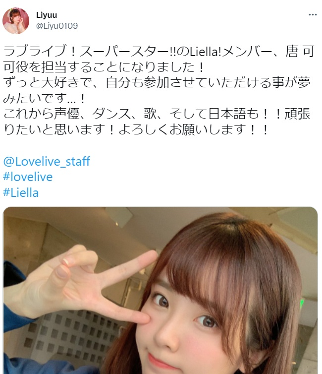
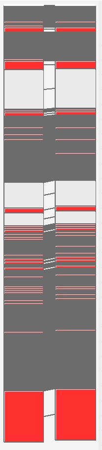

# Official Writeup of 탕쿠쿠의유혹

## Introduction

This is the official writeup of the challange tangkukueyuhog. This is an easy miscellaneous challange, right? (lol)

The author constructed this challange because of these various reasons.

First, it's normal to be faced with unknown languages when surfing websites, so am I. In my opinion, it's a must to grasp the ability of mastering translating tools/applications. Because of this, I wrote a Chinese-Korean-Japanese quiz to challenge competitors' ability(but maybe easier to Japanese-master). I have never learned Korean, so I have to translate many Korean sentences when conducting challenge. I made great efforts to type the Korean letters used in the title, and the sentence in the description is also carefully selected from twitter, which expressed the praise for the anime girl. I hope that, with my quiz, you can find the beauty of all languages in this world.

What's more, this quiz also proposes a funny way of stegno information transmission, called diff-based stegno. If you want to send a hidden information to your intimate friend, u can use a meme pic obtained by you two to stegno info, then send it losslessly, or frequency-based steg which may be able to send lossly. In this quiz, I use LSB jpg steg to realize my idea.

The most important thing I hope competitors can learn from this challenge is the jpg stegno. For a long time, CTF stegno challengers are trapped in lossless pixel analysis or ready-made stegno tools(well known as so-called 'tool quiz'). To me, I extremely hate tool quizzes, especially those without any tool-relevant hints, as if this tool had been known by everyone. In my opinion, the only all-known information of stegno quizzes is the picture document and the 'ingredients' of this document. Further to say, theoretically speaking, as long as you understand how some format of picture documents are formed, you can solve it, and the only acceptable tool quizzes are combined with obvious OSINT implications/hints/suggestions. I purposely choose jpg as quiz format this time, because jpg is a familiar format in our normal life, but it seems that few people actually 'understand' it, and nearly all CTF quizzes about jpg are boring tool quizzes. Those who know jpg well will of course solve this quiz quickly, but those who are tamed by jpg stegno tools may never beat this quiz.

## OSINT

As you can see, this puzzle gives you a picture and a personal twitter homepage. Your first mission is to find the original pic corresponding to the pic given.

Notice that the pic given is called '6cv_large.jpg', and it's easy to be aware that twitter has various compressed version of posted pics(e.g. middle, large). So just download the large version.

There are various ways to find the original pic. You can use search engines or you can simply search that in twitter. Specific operations are just passed over. In common, you can easily find the original image in less than 10 mins(according to the tests constructed by our unwitting term members).

## Steganography

So now you get the ori pic. What should we do next?

You can simply try to diff this 2 pics.

What an amazing results(ﾟДﾟ)ﾉ

The header of two pics seems to be identical. But data parts are partly identical and partly different.

*(APP1 Block unexceptedly changed /(ㄒoㄒ)/~~, explained in the apology part, 御免なさい)*

However, gazing at the identical header, you can roughly guess that this may be a stegno algo effected on the quantized data.

But there's no need to dread, the author just writes an easy stegno algorithm. Although these two pictures are progressive jpeg, author didn't play some tricks during the process of decoding jpg.

Now we can conclude that this is a jpg-based, diff-based stegno, so you should focus on the DCT results of two pictures.

Use tools like opencv to get DCT Matrices and then diff the DCT results, you'll find that, in each 8×8 blocks of Y plane, only the 6 blocks on the top left corner may change. It's clear that you should use the zigzag order.

How to get the hidden information? If you noticed the message hidden at the end of the picture, you can guess that changed pixel means 1, and unchanged represents 0. After trials, it's aware that information should be read in normal baseline jpg order(l2r & u2d).

*(Sorry, the hint "Liella, did you change or not?" disappeared for the reason I mentioned in the apology part, but you can still guess the stegno method by statistical analyses, which is a normal stegno detection method, and at the first time I actually indeed want challengers to solve this quiz without the hint)*

Now you get the flag and congrats(>ω<)

## Epilogue

If you follow my wp above and actually use Opencv or PIL to get YCrCb values, congrats, you may get a broken picture.

As for the reason, you may have observed that the hidden picture is webp, and that Opencv & PIL read jpg as RGB(to be exactly BGR). Rounding twice to get YCrCb values, you may find about 0.05% errors(or more). PNG/JPG pics may be safe from damage, but WEBP, which is deeply compressed, can't(maybe u can try to recover it?). So small deviations invite the corruption of image❛ڡ❛

So, why not try some more underlying tools?ԅ( ˘ω˘ ԅ)

In a nutshell, this puzzle is easy to solve, but it's hard to set( •̥́ ˍ •̀ू )

I print out all DQTs in different quality factors, and find that no one accords with the twitter picture(using informal DQTs?), because of which, I have to decode & encode pics on my own instead of simply changing the DCT values and form pics with Opencv.

Thank Mr.4 for helping me fix the decode/encode scripts, I'm a noob in writing codesT_T

## Apology

When uploading this quiz to the gitlab cloud, I didn't use zip compression. As a result, gitlab changed the header of the jpg and deleted the small hint at the end of the jpg, which to some extent breaks the elegance of this question. The original image and the new image's headers should have been identical originally, and if you diff these two pics, you can be 100 percent sure you find the right pic(now you have to watch carefully to find that these two pic have the same DQT and HT). This mistake undoubtedly added some small difficulties to competitors. However the silver lining is this quiz is still completely solvable(L3H solved this quiz, as you can see). Gitlab didn't change the DQT and Huffman table. The reason is that, during the inspection, I just used my script to confirm that the problem can be solved, forgetting to check whether the binary has been changed. Again, I solemnly apologize for my mistake, the small obstacles that may occur to challenger.

I have posted both the competition edition and the actual edition of this quiz together with my wp.

Here, I also recommand dear competitors to take a look to the wp from L3H Sec, whose step is very detailed, however the non-Chinese speakers have to translate themselves.

[2022 ACTF WP of L3H](https://hust-l3hsec.feishu.cn/wiki/wikcnekWDlzFWO1xC9Dk3DcU64h)